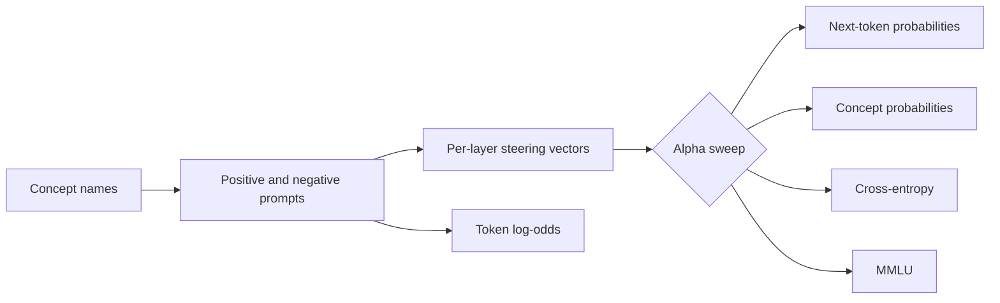

# Steering Strength Experiments

Activation-steering experiments for causal language models, including prompt generation, steering-vector extraction, and evaluation across steering strengths.

This repository contains the code for [*Towards Understanding Steering Strength*](https://arxiv.org/abs/2602.02712). It can run a model on one GPU or split it across several GPUs (tensor parallelism).

## What it does

The pipeline has three main stages:



The repository provides:

- positive and negative prompt generation;
- per-layer steering vectors from activation mean differences;
- next-token probability curves over steering strength `alpha`;
- binary and continuous concept-probability scoring with a judge model;
- cross-entropy and perplexity curves;
- MMLU evaluation;
- token log-odds for positive versus negative prompts;
- plots for saved experiment results;
- automatic GPU selection and parallel execution of independent jobs;
- CPU tests that do not download models.

## Installation

### Requirements

- Linux
- Python 3.12
- CUDA-capable GPU for real experiments
- enough GPU memory for each running model
- Hugging Face access for gated models

Create an isolated environment and install the pinned packages:

```bash
python3.12 -m venv .venv
source .venv/bin/activate
python -m pip install --upgrade pip
python -m pip install -r requirements.txt
```

Run commands from the repository root and expose the local packages:

```bash
export PYTHONPATH="$PWD${PYTHONPATH:+:$PYTHONPATH}"
```

Log in before using gated Hugging Face models:

```bash
hf auth login
```

`requirements.txt` pins the versions used by the current test environment. `build_monarch.sh` is available when Monarch must be built with local system dependencies instead of using the installed wheel.

### Verify the installation

The test suite uses tiny local models and CPU stand-ins, so it does not need CUDA or network access:

```bash
python -m pytest -q
```

Expected result:

```text
17 passed, 9 subtests passed
```

## Quick start

This small example generates prompts, extracts one steering vector, and measures next-token probabilities with a fixed seed.

```bash
export MODEL="openai-community/gpt2"
export SEED=42
```

### 1. Generate prompt datasets

```bash
python experiments/generate_prompts.py \
  --model_generating_concept "$MODEL" \
  --models "$MODEL" \
  --concepts joy \
  --out_dir prompts \
  --n_related 20 \
  --n_unrelated 20 \
  --batch_size 10 \
  --max_new_tokens 64 \
  --seed "$SEED" \
  --model_parallel_size 1 \
  --dtype float32
```

### 2. Extract a steering vector

```bash
python experiments/generate_steering_vectors.py \
  --models "$MODEL" \
  --in_dir prompts \
  --save_dir steering_vectors \
  --layers 0 \
  --batch_size 10 \
  --seed "$SEED" \
  --model_parallel_size 1 \
  --dtype float32
```

### 3. Sweep steering strength

```bash
python experiments/generate_next_token_probs.py \
  --models "$MODEL" \
  --steer_dir steering_vectors \
  --contexts_file data/contexts.jsonl \
  --out_dir plot_data \
  --layers 0 \
  --alpha_start -10 \
  --alpha_end 10 \
  --alpha_steps 21 \
  --seed "$SEED" \
  --model_parallel_size 1 \
  --dtype float32
```

## Command reference

| Command | Purpose | Main inputs |
| --- | --- | --- |
| `experiments/generate_prompts.py` | Generate positive and negative prompts | model, concepts |
| `experiments/generate_steering_vectors.py` | Extract per-layer steering vectors | prompt directory |
| `experiments/generate_next_token_probs.py` | Sweep next-token probabilities | steering vectors, contexts |
| `experiments/generate_concept_probs.py` | Compute binary concept scores | generator, judge, contexts |
| `experiments/generate_concept_probs_continuous.py` | Compute continuous concept scores | generator, judge, contexts |
| `experiments/rescore_concept_probs_continuous.py` | Rescore saved completions | saved concept-probability files |
| `experiments/generate_cross_entropy.py` | Sweep cross-entropy and perplexity | steering vectors, parquet data |
| `experiments/generate_mmlu.py` | Sweep MMLU accuracy | steering vectors, MMLU tasks |
| `experiments/generate_log_odds.py` | Compare token likelihoods | positive and negative prompts |
| `experiments/generate_eval_dataset.py` | Download one evaluation parquet | Hugging Face dataset |
| `utils/plot.py` | Plot saved experiment results | NPZ or MMLU JSON artifact |

Every command exposes its full options through `--help`:

```bash
python experiments/generate_steering_vectors.py --help
```

For binary or continuous concept probabilities, cross-entropy, and MMLU,
`--layer N` selects one exact zero-based layer. `--layers N` samples `N` layers
uniformly across the model.

## Evaluation examples

### Binary concept probability

```bash
python experiments/generate_concept_probs.py \
  --models google/gemma-3-1b-it \
  --judge_model google/gemma-3-12b-it \
  --steer_dir steering_vectors \
  --contexts_file data/contexts.jsonl \
  --out_dir concept_probs_data \
  --seed 42
```

### Continuous concept probability

```bash
python experiments/generate_concept_probs_continuous.py \
  --models google/gemma-3-1b-it \
  --judge_model AtlaAI/Selene-1-Mini-Llama-3.1-8B \
  --steer_dir steering_vectors \
  --contexts_file data/contexts.jsonl \
  --out_dir concept_probs_data_continuous \
  --alpha_start -40 \
  --alpha_end 40 \
  --alpha_steps 41 \
  --seed 42
```

### Cross-entropy

Download one FineWeb parquet shard:

```bash
python experiments/generate_eval_dataset.py \
  --dataset HuggingFaceFW/fineweb-edu \
  --remote_name sample-10BT \
  --split train \
  --file_idx 0 \
  --out_dir fineweb_eval_parquet
```

Run the sweep:

```bash
python experiments/generate_cross_entropy.py \
  --models openai-community/gpt2 \
  --steer_dir steering_vectors \
  --eval_parquet fineweb_eval_parquet/sample/10BT/000_00000.parquet \
  --out_dir cross_entropy \
  --seed 42
```

### MMLU

```bash
python experiments/generate_mmlu.py \
  --models openai-community/gpt2 \
  --tasks HIGH_SCHOOL_COMPUTER_SCIENCE \
  --max_problems_per_task 8 \
  --steer_dir steering_vectors \
  --out_dir mmlu \
  --seed 42
```

Omit `--max_problems_per_task` to evaluate every question.

### Token log-odds

```bash
python experiments/generate_log_odds.py \
  --models openai-community/gpt2 \
  --prompts_dir prompts \
  --out_dir log_odds
```


## Plotting results

`utils/plot.py` detects the saved result type and writes a publication-style
figure at 300 DPI:

```bash
python -m utils.plot path/to/layer_0_concept_probs.npz \
  --output concept_probs.png
```

It supports binary and continuous concept probabilities, next-token curves,
MMLU, cross-entropy, perplexity, and token log odds. Use `--metric perplexity`
for a perplexity plot or `--token_set alphamin` for tokens selected at the
lowest alpha. Perplexity uses a log scale automatically. Dense curves use
spaced or no markers, decoded whitespace is shown in token labels, and MMLU
uses a focused accuracy range.

Use a `.pdf` or `.svg` output name for a vector figure:

```bash
python -m utils.plot path/to/layer_0_mmlu.json --output mmlu.pdf
```

The plotting functions can also be imported:

```python
from utils.plot import plot_concept_probs, save_figure

figure, axis = plot_concept_probs("layer_0_concept_probs.npz")
save_figure(figure, "concept_probs.png")
```

## Model parallelism

Large models can be split across several GPUs. The same commands also handle models that fit on one GPU.

| Option | Meaning |
| --- | --- |
| `--model_parallel_size auto` | Estimate memory and choose how many GPUs each model needs |
| `--model_parallel_size 1` | Force each running model to use one GPU |
| `--max_gpus N` | Limit how many visible GPUs may be used |
| `--gpu_utilization 0.90` | Reserve part of each GPU's free memory |
| `--inference_headroom 1.20` | Add memory above the estimated model weights |
| `--plan_only` | Print the layout without loading model weights |
| `--local_files_only` | Prevent Hugging Face downloads |
| `--trust_remote_code` | Allow model-provided Python code |

Inspect a large-model layout before loading weights:

```bash
python experiments/generate_steering_vectors.py \
  --models Qwen/Qwen2.5-72B \
  --in_dir prompts \
  --save_dir steering_vectors \
  --dtype bfloat16 \
  --model_parallel_size auto \
  --plan_only
```

`--model_parallel_size 1` only works when the model and its working memory fit on one GPU. For automatic multi-GPU loading, the model's Transformers configuration must describe how the model can be split.

See [docs/model_parallelism.md](docs/model_parallelism.md) for placement rules, scheduling, and current constraints.

## Reproducibility

For comparisons between implementations:

1. use the same model files, prompts, contexts, steering vectors, dtype, and command arguments;
2. pass the same `--seed` to commands that expose it;
3. keep the same number of model workers and the same job order when generation uses sampling;
4. compare arrays and metadata inside the output files, not only filenames.

A fixed seed controls the random-number generators used by this code. It does not guarantee bit-for-bit equality across different GPUs, CUDA kernels, model revisions, or dependency versions.

## Data formats

### Prompt JSONL

Each line stores one generated prompt:

```json
{"concept": "joy", "kind": "positive", "text": "..."}
{"concept": "joy", "kind": "negative", "text": "..."}
```

### Context JSONL

Shared negative contexts and concept-specific positive contexts are stored separately:

```json
{"negative": ["negative context 1", "negative context 2"]}
{"joy": ["positive context 1", "positive context 2"]}
```

### Steering-vector files

`steering_vectors/<model_slug>/<concept_slug>/layer_<index>.pt` contains:

- model and concept metadata;
- layer index and hidden size;
- the steering vector;
- tensor-parallel size.

## Output layout

Evaluation outputs are grouped by model and concept:

```text
<out_dir>/
└── <model_slug>/
    └── <concept_slug>/
        ├── layer_*.pt
        ├── layer_*_ctx_*.npz
        ├── layer_*_concept_probs.npz
        ├── layer_*_cross_entropy.npz
        ├── layer_*_mmlu.json
        └── log_odds_topk.npz
```

The arrays and metadata are stored inside each `.npz`, `.pt`, or `.json` file.

## Project structure

| Path | Responsibility |
| --- | --- |
| `experiments/` | Commands you run and code that assigns each job |
| `actors/tasks/` | The calculations performed by each experiment |
| `actors/model_actors.py` | Loads the models used by experiment tasks |
| `utils/data.py` | Prompt, context, and parquet loading |
| `utils/modeling.py` | Model-layer, tokenizer, and steering-vector helpers |
| `utils/runtime/` | Chooses GPUs and assigns work to model workers |
| `tests/` | CPU pipeline and placement tests |
| `docs/` | Detailed multi-GPU documentation |
| `example_run.sh` | Slurm pipeline example |
| `build_monarch.sh` | Local Monarch build helper |

Experiment settings live in small dataclasses under `actors/tasks/`. Each command reads its arguments, then `experiments/runners.py` assigns the work.

## Troubleshooting

### `ModuleNotFoundError` for `actors` or `utils`

Run commands from the repository root and set:

```bash
export PYTHONPATH="$PWD${PYTHONPATH:+:$PYTHONPATH}"
```

### CUDA out of memory

Use `--plan_only` first, keep `--model_parallel_size auto`, reduce batch or sequence sizes, or lower `--max_gpus` only when intentionally testing a smaller layout.

### Model cannot use multiple GPUs

The model must expose a compatible Transformers tensor-parallel plan. If it does not, use `--model_parallel_size 1` only when it fits on one GPU.

### Hugging Face access errors

Confirm the model or dataset ID, accept any gated-model terms, and run `hf auth login`.

### Transformer layers are not detected

Pass the model's layer-list path explicitly:

```bash
--layer_path model.layers
```

## Citation

If you use this repository, cite:

```bibtex
@article{taimeskhanov2026towards,
  title={Towards Understanding Steering Strength},
  author={Taimeskhanov, Magamed and Vaiter, Samuel and Garreau, Damien},
  journal={ICML},
  year={2026}
}
```
